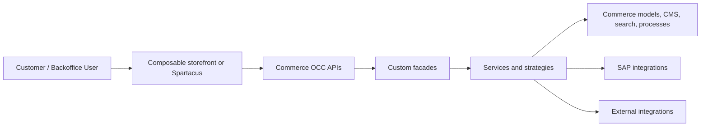

# Project Report Shape

Use this outline when the user asks for a full SAP Commerce project analysis.

## Executive Snapshot

| Topic | Finding | Confidence | Evidence |
|---|---|---|---|
| Business purpose | | | |
| SAP Commerce version | | | |
| Storefront version | | | |
| B2B/B2C posture | | | |
| Customization intensity | | | |

## Architecture Diagram

Prefer Mermaid with concrete project labels:

Replace generic nodes with the site names, custom extensions, and integration families supported by repository evidence.

## Tables

Create these tables when the evidence exists:

1. Version and runtime baseline.
2. Extension map grouped by SAP/OOTB, custom, vendor, data, OCC, backoffice, and integration.
3. OOTB-vs-custom comparison with changed item types, Spring overrides, OCC endpoints, CMS/frontend overrides, and deployment data.
4. Data-model hotspots listing item types, relations, enums, extension of OOTB types, and upgrade sensitivity.
5. Integration map listing system, direction, protocol or mechanism, evidence, and risk.
6. Upgrade baseline listing fragile override points, missing inputs, and files to revisit.

## Narrative Sections

Cover these sections in order:

1. What the project appears to do.
2. Backend architecture.
3. Storefront architecture or storefront evidence gap.
4. B2B/B2C classification.
5. Data model and content model.
6. SAP integrations.
7. External integrations.
8. Customization hotspots and closeness to OOTB.
9. Unknowns and next inspection steps.
