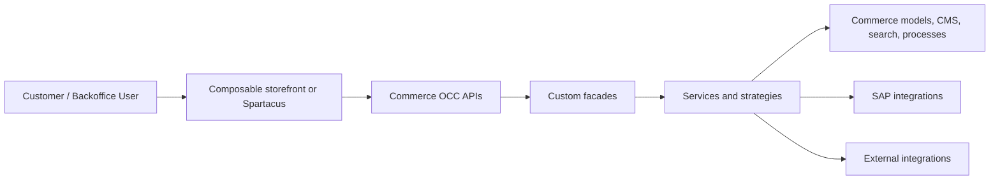

# Project Report Shape

Use this outline when the user asks for a full SAP Commerce project analysis.

## Executive Snapshot

| Topic | Finding | Confidence | Evidence |
|---|---|---|---|
| Business purpose | | | |
| Business model and channels | | | |
| SAP CX product scope | | | |
| Deployment model | | | |
| SAP Commerce version | | | |
| Storefront version | | | |
| B2B/B2C posture | | | |
| Customization intensity | | | |
| Change-safety posture | | | |

## Architecture Diagram

Prefer Mermaid with concrete project labels:

Replace generic nodes with the site names, custom extensions, and integration families supported by repository evidence.

## Core Tables

Create these tables when the evidence exists:

1. Solution map listing business capabilities, channels, SAP CX products, deployment clues, and ownership clues.
2. Version and runtime baseline.
3. Extension map grouped by SAP/OOTB, custom, vendor, data/setup, OCC, backoffice, integration, operations, and tests.
4. Site/store/catalog/content map with languages, currencies, warehouses, Solr, and content structure when visible.
5. Data-model map and hotspot table listing business concepts, item types, relations, enums, source systems, consumers, and upgrade sensitivity.
6. Critical-flow map and OCC contract map for the traced storefront/backend journeys.
7. Integration map listing system, master data role, direction, sync/async behavior, trigger, protocol or mechanism, error handling, evidence, and risk.
8. OOTB-vs-custom comparison with changed item types, Spring overrides, OCC endpoints, checkout/order customizations, CMS/frontend overrides, and deployment data.
9. Risk register, change-impact matrix, and upgrade baseline listing fragile override points, missing inputs, and files to revisit.

## Diagrams

Add evidence-backed Mermaid diagrams when they clarify the analysis:

1. Architecture and channel map.
2. Critical flows such as login, product search/PDP, add to cart, checkout/place order, order status/documents, product import, and price/stock fetch.
3. Integration or data-ownership flow when multiple systems participate.

## Narrative Sections

Cover these sections in order:

1. What the project appears to do.
2. Business model, channels, deployment, and ownership clues.
3. Backend structure: extensions, Spring overrides, data setup, runtime components, and layered responsibilities.
4. Data model, site/store/catalog/content model, and source-system ownership.
5. Storefront architecture, OCC contract, and storefront evidence gap when frontend code is absent.
6. Critical journeys, including cart/checkout/order and checkout-to-ERP when applicable.
7. SAP integrations, external integrations, async behavior, and failure handling.
8. Search/CMS/SmartEdit, Backoffice, security, performance, caching, observability, deployment, testing, documentation, and upgradeability signals that affect change safety.
9. Customization hotspots, OOTB closeness, risks, quick wins, and change-impact notes.
10. Unknowns, unassessed areas, and next inspection steps.
