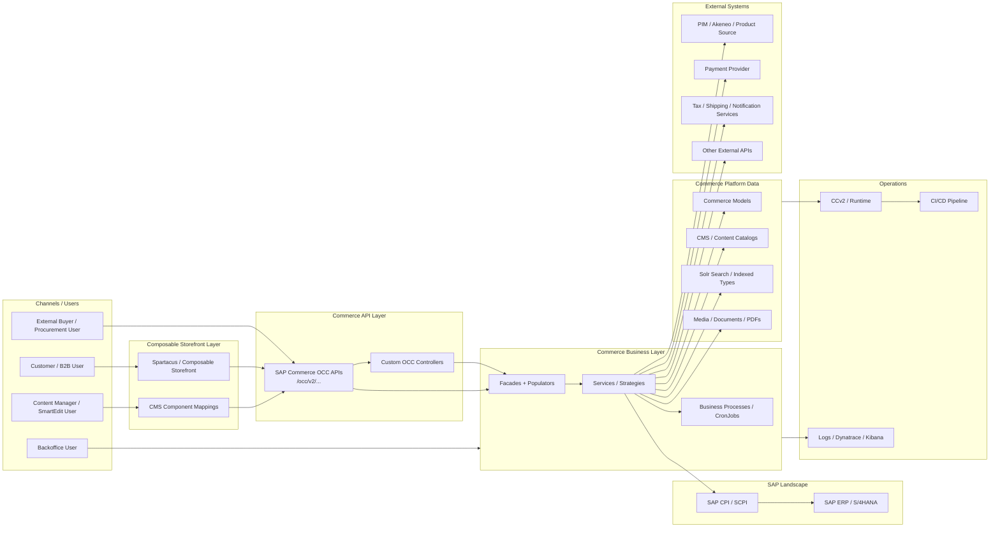
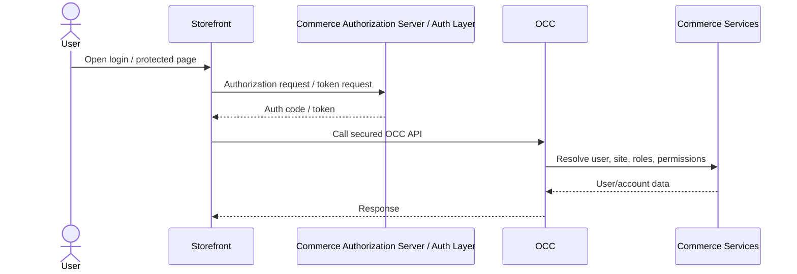
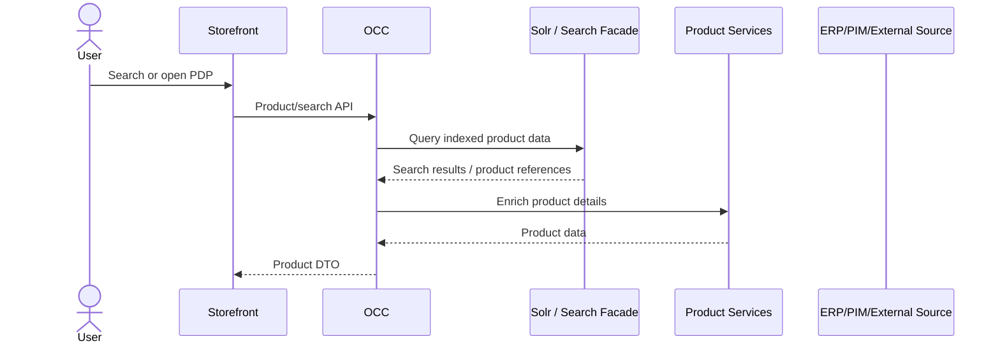
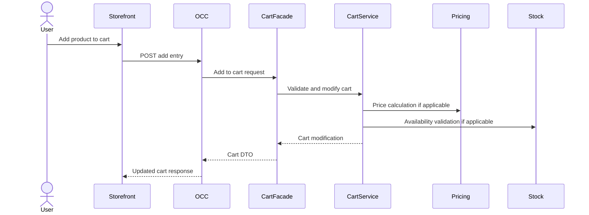
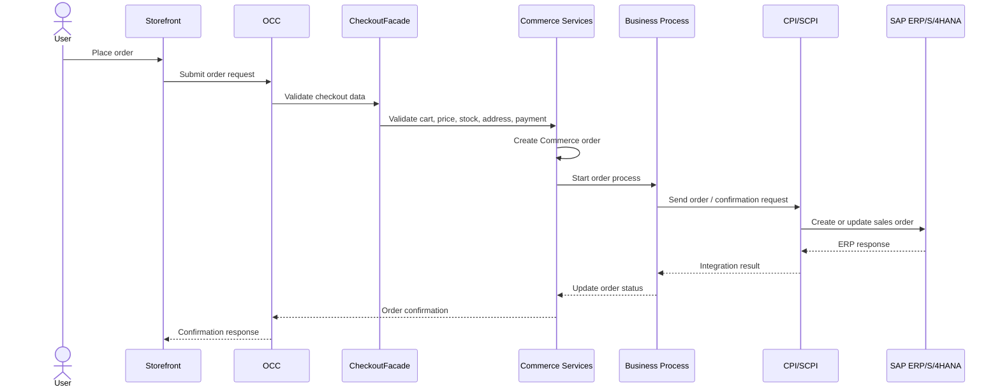
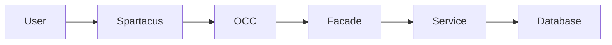
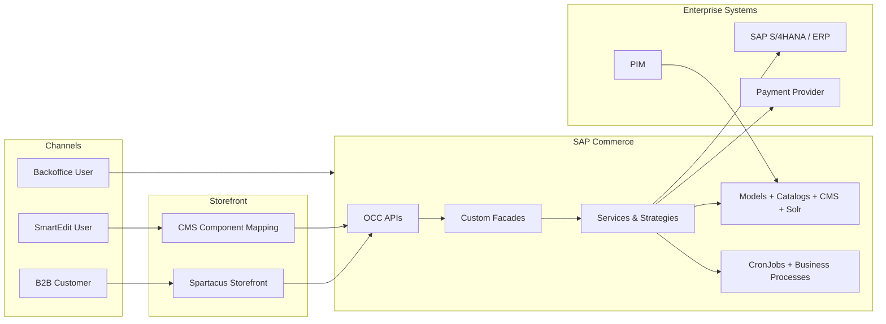

# SAP Commerce Project Analysis Report Shape

Use this report shape when the user asks for a full SAP Commerce / SAP CX project analysis based on backend code, Spartacus/composable storefront code, deployment files, configuration, impex, or uploaded repository evidence.

The report must be evidence-driven. Do not guess. When evidence is missing, explicitly mark the area as unknown or unassessed.

The report should help a SAP CX Enterprise Architect quickly understand:
- What the project does
- How the solution is structured
- Where SAP Commerce is standard vs customized
- Which systems own which data
- Which flows are business-critical
- Where change risk exists
- What should be inspected next

---

## 1. Executive Snapshot

Start with a compact executive table.

| Topic | Finding | Confidence | Evidence |
|---|---|---:|---|
| Business purpose |  | High / Medium / Low / Unknown |  |
| Business model | B2B / B2C / B2B2C / Marketplace / Dealer portal / PunchOut / Other |  |  |
| Channels | Spartacus, OCC, Backoffice, SmartEdit, mobile app, PunchOut, API-only, etc. |  |  |
| SAP CX product scope | SAP Commerce, Spartacus, CDC, CPQ, Emarsys, Sales Cloud, Service Cloud, CPI, etc. |  |  |
| Deployment model | CCv2 / on-prem / private cloud / unknown |  |  |
| SAP Commerce version |  |  |  |
| Storefront version | Spartacus / composable storefront / Angular version |  |  |
| B2B/B2C posture |  |  |  |
| Customization intensity | Low / Medium / High / Very High |  |  |
| Integration intensity | Low / Medium / High / Very High |  |  |
| Change-safety posture | Safe / Moderate / Risky / Fragile |  |  |
| Upgrade posture | Clean / Manageable / Risky / Unknown |  |  |
| Biggest architectural risk |  |  |  |
| Biggest missing input |  |  |  |

Use confidence as follows:

| Confidence | Meaning |
|---|---|
| High | Directly supported by repository evidence |
| Medium | Strongly inferred from multiple signals |
| Low | Weakly inferred or incomplete evidence |
| Unknown | No reliable evidence found |

---

## 2. Architecture at a Glance

Provide an evidence-backed architecture diagram.

Avoid generic labels like `Custom facades` or `SAP integrations` when concrete names exist. Replace generic nodes with actual project labels such as extension names, base sites, storefront app names, integration systems, custom OCC modules, or business capability names.

### Preferred Diagram Style

Use Mermaid `flowchart LR` or `flowchart TB`.

Group the diagram into layers:
- Channels
- API layer
- Commerce application layer
- Commerce platform/data layer
- SAP systems
- External systems
- Operations/observability

### Architecture Diagram Template



### Diagram Rules

- Use concrete project names when available.
- Keep the diagram readable; do not overload it with every class.
- If frontend code is absent, show the storefront as `Unassessed / Not Provided`.
- If integration evidence is partial, mark nodes with `Evidence incomplete`.
- Do not show systems that are not supported by repository evidence.

---

## 3. What the Project Appears to Do

Write a short narrative summary.

Cover:
- Apparent business purpose
- Main users
- Main commerce capabilities
- Key channels
- Key back-office/admin capabilities
- Key integrations
- Any signs of country, brand, market, or business-unit segmentation

Example structure:

```md
Based on the repository evidence, this project appears to support `<business capability>` for `<user group/channel>`.
The solution seems to use SAP Commerce as `<system role>` and exposes capabilities through `<channels>`.
The strongest evidence comes from `<files/classes/configs>`.
The main architectural complexity appears to be around `<customization/integration/data model/checkout/etc.>`.
```

---

## 4. Evidence Register

Before deep analysis, provide a short evidence register.

| Evidence Area | Files / Classes / Configs Reviewed | What It Proves | Gaps |
|---|---|---|---|
| Extensions |  |  |  |
| Data model |  |  |  |
| Base site/store/catalog |  |  |  |
| OCC APIs |  |  |  |
| Spartacus |  |  |  |
| Integrations |  |  |  |
| Cronjobs/processes |  |  |  |
| Deployment |  |  |  |

This section helps prevent unsupported assumptions.

---

## 5. Solution Map

Create this table when evidence exists.

| Capability | Channel | SAP CX Product / Module | Backend Area | Frontend Area | Owner Clues | Evidence | Notes |
|---|---|---|---|---|---|---|---|
| Product browsing | Spartacus / OCC | SAP Commerce Product + Solr |  |  |  |  |  |
| Cart | Spartacus / OCC | SAP Commerce Cart |  |  |  |  |  |
| Checkout | Spartacus / OCC | SAP Commerce Checkout |  |  |  |  |  |
| Order history | My Account / OCC | SAP Commerce Order |  |  |  |  |  |
| Content management | SmartEdit / CMS | SAP Commerce CMS |  |  |  |  |  |
| B2B organization | Backoffice / OCC | SAP Commerce B2B |  |  |  |  |  |
| Reports / documents | OCC / My Account | Custom / ERP-backed |  |  |  |  |  |

Only include rows supported by evidence.

---

## 6. Version and Runtime Baseline

| Area | Finding | Evidence | Risk / Comment |
|---|---|---|---|
| SAP Commerce version |  |  |  |
| Java version |  |  |  |
| Node version |  |  |  |
| Angular version |  |  |  |
| Spartacus/composable storefront version |  |  |  |
| Deployment model | CCv2 / on-prem / unknown |  |  |
| Solr mode | Embedded / standalone / cloud / unknown |  |  |
| Database clues |  |  |  |
| Build system | Ant / Gradle / Maven / mixed |  |  |
| CI/CD clues |  |  |  |
| Observability tooling |  |  |  |

Flag incompatibility risks, especially:
- SAP Commerce version vs Java version
- Spartacus version vs Commerce OCC compatibility
- Angular version vs Spartacus version
- Legacy OAuth flows
- Deprecated SAP Commerce APIs
- Copied OOTB classes

---

## 7. Extension Map

Group extensions clearly.

| Group | Extension | Type | Purpose | Depends On | Key Files | Risk |
|---|---|---|---|---|---|---|
| SAP / OOTB |  | Platform / accelerator / integration |  |  |  |  |
| Custom core |  | Core model/service |  |  |  |  |
| Custom facade |  | Facade / DTO / populator |  |  |  |  |
| Custom OCC |  | Webservices |  |  |  |  |
| Custom storefront support |  | CMS/OCC/frontend support |  |  |  |  |
| Integration |  | ERP/PIM/payment/etc. |  |  |  |  |
| Backoffice |  | Admin tooling |  |  |  |  |
| Data/setup |  | Initial data / impex |  |  |  |  |
| Operations |  | Cronjobs / monitoring / cleanup |  |  |  |  |
| Tests |  | Unit/integration tests |  |  |  |  |

Also include a short interpretation:

```md
The extension structure suggests a `<low/medium/high>` customization footprint.
The most business-specific extensions appear to be `<names>`.
The most risk-sensitive extensions appear to be `<names>` because `<reason>`.
```

---

## 8. Backend Architecture and Layering

Analyze whether the backend follows clean SAP Commerce layering.

Cover:
- Controllers
- Facades
- Converters/populators
- Services
- Strategies
- DAOs
- Interceptors
- Validators
- Events/listeners
- Cronjobs
- Business processes

### Layering Table

| Layer | Evidence | Responsibility Observed | Architectural Quality | Risk |
|---|---|---|---|---|
| OCC controllers |  |  | Clean / Mixed / Poor / Unknown |  |
| Facades |  |  |  |  |
| Populators/converters |  |  |  |  |
| Services |  |  |  |  |
| Strategies |  |  |  |  |
| DAOs |  |  |  |  |
| Interceptors/validators |  |  |  |  |
| Events/listeners |  |  |  |  |
| Cronjobs/processes |  |  |  |  |

Flag issues such as:
- Business logic inside controllers
- Heavy logic inside populators
- Direct FlexibleSearch everywhere
- External calls inside interceptors
- Static utility classes replacing proper services
- OOTB class copies
- Missing authorization checks in custom APIs

---

## 9. Data Model Analysis

Start with all custom `*-items.xml`.

### Data Model Map

| Business Concept | Item Type / Attribute | Extends | Relation / Enum | Source System | Consumers | Upgrade Sensitivity | Evidence |
|---|---|---|---|---|---|---|---|
|  |  |  |  | Commerce / ERP / PIM / external | OCC / Solr / Backoffice / process | Low / Medium / High |  |

### Data Model Hotspots

| Hotspot | Why It Matters | Evidence | Risk | Recommendation |
|---|---|---|---|---|
| Product customization | Impacts Solr, PDP, catalog import, upgrades |  |  |  |
| Customer/B2B customization | Impacts security and account ownership |  |  |  |
| Cart/order customization | Impacts checkout, pricing, ERP integration |  |  |  |
| CMS customization | Impacts SmartEdit and Spartacus rendering |  |  |  |
| Cronjob/process model customization | Impacts operations and recoverability |  |  |  |

Flag:
- Large JSON stored as String/Text
- Sensitive fields without encryption
- Business statuses as free text
- Missing indexes
- Abused collection attributes
- Duplicate data across cart/order/consignment
- Direct changes to OOTB core types with high upgrade impact

---

## 10. Site, Store, Catalog, Content, and Search Model

Create when evidence exists.

| Area | Finding | Evidence | Risk / Comment |
|---|---|---|---|
| Base sites |  |  |  |
| Base stores |  |  |  |
| Product catalogs |  |  |  |
| Content catalogs |  |  |  |
| Catalog versions | Staged / Online / both |  |  |
| Languages |  |  |  |
| Currencies |  |  |  |
| Countries / regions |  |  |  |
| Warehouses |  |  |  |
| Solr indexed types |  |  |  |
| CMS page templates |  |  |  |
| CMS components |  |  |  |
| CMS restrictions |  |  |  |

Then explain:
- Whether the project appears single-site or multi-site
- Whether catalogs are shared or market-specific
- Whether content is CMS-driven or hardcoded
- Whether Solr visibility aligns with product/catalog rules

---

## 11. Storefront / Spartacus Architecture

If frontend code is available, analyze:

| Area | Finding | Evidence | Risk |
|---|---|---|---|
| Angular version |  |  |  |
| Spartacus/composable storefront version |  |  |  |
| Feature modules |  |  |  |
| CMS component mappings |  |  |  |
| OCC endpoint customizations |  |  |  |
| Auth configuration |  |  |  |
| Routing |  |  |  |
| State management |  |  |  |
| SSR setup |  |  |  |
| Styling/theming |  |  |  |
| Environment config |  |  |  |
| Performance signals |  |  |  |

If frontend code is absent, include:

```md
Storefront Evidence Gap:
Frontend code was not available in the inspected evidence. Therefore, storefront routing, CMS mappings, custom OCC adapters, auth configuration, SSR behavior, and client-side calculation logic could not be assessed. Backend OCC contracts should be treated as only one side of the channel architecture until frontend evidence is reviewed.
```

Flag:
- Hardcoded baseSite/language/currency
- Direct HTTP calls instead of OCC adapters/connectors
- Business calculations duplicated in Angular
- Global CSS hacks
- SSR browser-only failures
- Duplicate OCC calls
- Custom auth without clear token lifecycle

---

## 12. OCC Contract and API Map

Create an OCC contract table for traced APIs.

| Journey | Endpoint | Method | Controller | Facade/Service | Request DTO | Response DTO | Auth | Frontend Consumer | Risk |
|---|---|---|---|---|---|---|---|---|---|
| Product search |  | GET |  |  |  |  | Anonymous / User |  |  |
| PDP |  | GET |  |  |  |  |  |  |  |
| Add to cart |  | POST |  |  |  |  |  |  |  |
| Checkout |  | POST |  |  |  |  |  |  |  |
| Place order |  | POST |  |  |  |  |  |  |  |
| Order history |  | GET |  |  |  |  |  |  |  |
| Documents/reports |  | GET/POST |  |  |  |  |  |  |  |

Flag:
- Frontend-calculated business values
- Loose Map/String response structures
- Missing DTO validation
- Missing B2B authorization checks
- APIs exposing model internals
- APIs without versioning despite custom contracts

---

## 13. Critical Journey Maps

Trace only evidence-backed journeys.

### 13.1 Login / Authentication Flow



Mention actual auth mechanism if known:
- Authorization Code + PKCE
- CDC
- SSO / Azure / Entra
- ASM
- Legacy OAuth
- Unknown

### 13.2 Product Search / PDP Flow



Add ERP/PIM only if evidence supports real-time enrichment.

### 13.3 Add to Cart Flow



### 13.4 Checkout / Place Order Flow



If ERP call is synchronous before order creation or after order creation, adjust the diagram accordingly.

---

## 14. Cart, Checkout, Pricing, Stock, and Order Architecture

Create a focused table.

| Area | Observed Design | Evidence | Risk | Recommendation |
|---|---|---|---|---|
| Cart creation/restoration |  |  |  |  |
| Add to cart validation |  |  |  |  |
| Pricing | Commerce / ERP / external / mixed |  |  |  |
| Stock | Commerce / ERP / ATP / mixed |  |  |  |
| Tax | Commerce / external / unknown |  |  |  |
| Promotions/discounts | OOTB / custom / external |  |  |  |
| Payment |  |  |  |  |
| Delivery modes |  |  |  |  |
| Place order | Sync / async / mixed |  |  |  |
| ERP order submission |  |  |  |  |
| Order status ownership | Commerce / ERP / mixed |  |  |  |
| Failure recovery |  |  |  |  |

Flag:
- Pricing duplicated in frontend/backend
- Stock not revalidated at checkout
- ERP order creation without idempotency
- Cart/order ownership issues in B2B
- Calculation disabled or bypassed
- Order created in Commerce but not recoverable in ERP

---

## 15. Integration and Source-System Ownership

### Integration Map

| System | Business Role | Master Data Role | Direction | Sync/Async | Trigger | Protocol / Mechanism | Error Handling | Evidence | Risk |
|---|---|---|---|---|---|---|---|---|---|
| SAP S/4HANA / ERP | Pricing, stock, order, customer, invoices | Master / Consumer / Mixed | Inbound/Outbound | Sync/Async |  | REST/SOAP/CPI/IDoc/SFTP |  |  |  |
| PIM / Akeneo | Product data | Master | Inbound | Async | Cron/hot folder/API |  |  |  |  |
| Payment provider | Payment authorization | External processor | Outbound | Sync | Checkout | REST |  |  |  |
| Tax provider | Tax calculation | External processor | Outbound | Sync | Cart/checkout | REST |  |  |  |
| Email/SMS/WhatsApp | Notification | Consumer | Outbound | Async | Event/process |  |  |  |  |

### Data Ownership Matrix

| Data Domain | System of Record | Commerce Role | Replication / Fetch Pattern | Risk |
|---|---|---|---|---|
| Product master |  | Master/cache/consumer |  |  |
| Pricing |  |  |  |  |
| Stock |  |  |  |  |
| Customer |  |  |  |  |
| Address / partner functions |  |  |  |  |
| Orders |  |  |  |  |
| Invoices/documents |  |  |  |  |
| Content |  |  |  |  |

Flag:
- No timeout/retry policy
- No idempotency
- External calls inside interceptors
- No payload audit
- No reprocessing mechanism
- Environment URLs hardcoded
- Secrets stored unsafely

---

## 16. Search, CMS, SmartEdit, and Content Architecture

### Search / Solr

| Area | Finding | Evidence | Risk |
|---|---|---|---|
| Indexed types |  |  |  |
| Indexed properties |  |  |  |
| Custom value providers/resolvers |  |  |  |
| Facets/sorts |  |  |  |
| Variant indexing |  |  |  |
| Indexing jobs |  |  |  |
| Visibility logic |  |  |  |

### CMS / SmartEdit

| Area | Finding | Evidence | Risk |
|---|---|---|---|
| Page templates |  |  |  |
| Content slots |  |  |  |
| Custom CMS components |  |  |  |
| CMS restrictions |  |  |  |
| Navigation |  |  |  |
| SmartEdit readiness |  |  |  |
| Spartacus CMS mappings |  |  |  |

Flag:
- Heavy DB calls in Solr value providers
- Inconsistent visibility between Solr/PDP/cart
- Hardcoded CMS behavior in frontend
- CMS restrictions used as authorization
- SmartEdit CSP/CORS/preview issues
- Duplicate CMS impex causing unstable content

---

## 17. Backoffice and Operational Support

| Area | Finding | Evidence | Risk |
|---|---|---|---|
| Backoffice custom views |  |  |  |
| Editor area customization |  |  |  |
| Advanced search/list views |  |  |  |
| Custom actions |  |  |  |
| Integration monitoring |  |  |  |
| Order support tooling |  |  |  |
| Cronjob monitoring |  |  |  |
| Manual reprocessing |  |  |  |

Assess whether support teams can operate the solution without developers.

Flag:
- Critical support tasks require HAC/FlexibleSearch
- No reprocess button for failed integrations
- No visibility into external payloads
- Dangerous Backoffice actions without authorization

---

## 18. Security and Authorization

| Area | Finding | Evidence | Risk |
|---|---|---|---|
| Customer authentication |  |  |  |
| OAuth clients / token flow |  |  |  |
| B2B authorization |  |  |  |
| OCC endpoint security |  |  |  |
| Backoffice roles |  |  |  |
| Search restrictions |  |  |  |
| CMS restrictions |  |  |  |
| PII handling |  |  |  |
| Secrets handling |  |  |  |
| Logging of sensitive data |  |  |  |

Flag:
- Custom OCC APIs missing `@Secured` / authorization checks
- B2B unit access not validated
- Secrets in properties or impex
- Sensitive request/response payloads logged
- Frontend-only authorization decisions
- Legacy password/implicit OAuth flows

---

## 19. Performance, Caching, and Scalability

| Area | Finding | Evidence | Risk |
|---|---|---|---|
| FlexibleSearch usage |  |  |  |
| Populator performance |  |  |  |
| Interceptor performance |  |  |  |
| Cronjob batching |  |  |  |
| Solr indexing |  |  |  |
| Integration latency |  |  |  |
| OCC payload size |  |  |  |
| Spartacus bundle / SSR |  |  |  |
| Media handling |  |  |  |
| Cache usage |  |  |  |
| CDN/static assets |  |  |  |

Flag:
- FlexibleSearch in loops
- No pagination
- Heavy populators
- Synchronous external calls on PLP/PDP
- SSR calling too many APIs
- No DB indexes for custom query fields
- Over-caching customer-specific data

---

## 20. Deployment, Configuration, and Environment Management

| Area | Finding | Evidence | Risk |
|---|---|---|---|
| Deployment model |  |  |  |
| Build configuration |  |  |  |
| Environment properties |  |  |  |
| Secrets handling |  |  |  |
| Impex deployment |  |  |  |
| DB update strategy |  |  |  |
| Solr deployment |  |  |  |
| Media storage |  |  |  |
| CI/CD pipeline |  |  |  |
| Rollback approach |  |  |  |

Flag:
- Manual production configuration
- Environment-specific code
- Secrets committed
- No repeatable impex/data setup
- No rollback documentation

---

## 21. Testing and Quality Baseline

| Test Type | Evidence | Coverage Impression | Gaps |
|---|---|---|---|
| Unit tests |  |  |  |
| Service-layer tests |  |  |  |
| OCC/API tests |  |  |  |
| Integration tests |  |  |  |
| Spartacus unit tests |  |  |  |
| E2E tests |  |  |  |
| Performance tests |  |  |  |
| Contract tests |  |  |  |

Flag:
- No tests for checkout/order failure paths
- No tests for authorization boundaries
- No tests for integration retries
- No tests for custom Solr value providers
- No frontend/backend API contract tests

---

## 22. OOTB vs Custom Comparison

| Area | OOTB SAP Commerce Behavior | Project Customization | Evidence | Upgrade Risk |
|---|---|---|---|---|
| Product model |  |  |  |  |
| Customer/B2B model |  |  |  |  |
| Cart |  |  |  |  |
| Checkout |  |  |  |  |
| Order process |  |  |  |  |
| Pricing |  |  |  |  |
| Stock |  |  |  |  |
| OCC APIs |  |  |  |  |
| CMS |  |  |  |  |
| Backoffice |  |  |  |  |
| Solr |  |  |  |  |
| Auth/security |  |  |  |  |
| Deployment/config |  |  |  |  |

Use this to judge how close the project remains to SAP Commerce standard.

---

## 23. Customization Hotspots

| Hotspot | Evidence | Why It Is Important | Risk | Suggested Inspection |
|---|---|---|---|---|
|  |  |  |  |  |

Examples:
- Custom checkout strategy
- Custom price calculation
- Custom order submission
- Custom B2B authorization
- Custom Solr value providers
- Custom CMS components
- Custom OCC reports/documents APIs
- OOTB bean overrides
- Copied SAP classes
- Large utility classes
- Integration retry utilities

---

## 24. Risk Register

| ID | Risk | Impact | Likelihood | Severity | Evidence | Recommendation |
|---|---|---|---|---|---|---|
| R1 |  | Low / Medium / High | Low / Medium / High | Low / Medium / High / Critical |  |  |

Risk categories:
- Functional
- Integration
- Security
- Performance
- Upgrade
- Operational
- Data quality
- Testing
- Deployment

---

## 25. Change Impact Matrix

| Change Area | Likely Impacted Components | Files / Evidence | Risk | Testing Needed |
|---|---|---|---|---|
| Product model change | Solr, PDP, impex, Backoffice, integrations |  |  |  |
| Cart calculation change | Cart, checkout, order, frontend totals, tests |  |  |  |
| OCC DTO change | Spartacus models, adapters, API consumers |  |  |  |
| Integration endpoint change | Services, credentials, retry, monitoring |  |  |  |
| CMS component change | CMS impex, Spartacus mapping, SmartEdit |  |  |  |
| Auth change | OAuth clients, token flow, frontend config |  |  |  |

---

## 26. Upgrade Baseline

| Area | Signal | Evidence | Upgrade Risk |
|---|---|---|---|
| OOTB class copies | Yes / No / Unknown |  |  |
| Deprecated APIs |  |  |  |
| Spring bean overrides |  |  |  |
| Legacy OAuth flows |  |  |  |
| Accelerator dependencies |  |  |  |
| Spartacus compatibility |  |  |  |
| Java compatibility |  |  |  |
| Custom checkout/calculation/search overrides |  |  |  |
| Third-party library compatibility |  |  |  |

Add an upgrade-readiness verdict:

```md
Upgrade readiness appears `<clean/manageable/risky/fragile/unknown>` because `<reason>`.
The most important files/classes to revisit before upgrade are:
1. ...
2. ...
3. ...
```

---

## 27. Quick Wins

| Quick Win | Why It Helps | Effort | Risk Reduced | Evidence |
|---|---|---|---|---|
|  |  | Small / Medium / Large |  |  |

Examples:
- Add missing indexes
- Add integration timeout configuration
- Add correlation IDs
- Add retry/reprocess Backoffice action
- Add tests for custom checkout
- Move business logic out of controller/populator
- Document data ownership
- Replace hardcoded site/language values

---

## 28. Unknowns and Unassessed Areas

Be explicit.

| Area | What Is Unknown | Why It Matters | Next Step |
|---|---|---|---|
| Frontend |  |  |  |
| Deployment |  |  |  |
| Integrations |  |  |  |
| Security |  |  |  |
| Performance |  |  |  |
| Testing |  |  |  |

Do not hide gaps. Unknowns are important architectural output.

---

## 29. Next Inspection Steps

Prioritize next steps.

| Priority | Inspection Step | Why | Expected Outcome |
|---|---|---|---|
| P1 |  |  |  |
| P2 |  |  |  |
| P3 |  |  |  |

Example:

```md
P1: Trace place-order flow from OCC controller to ERP integration.
Why: Checkout and order integration are usually the highest-risk enterprise flow.
Expected outcome: Confirm whether order creation is sync/async, idempotent, recoverable, and observable.
```

---

## 30. Final Architect Verdict

End with a concise verdict.

Include:
- Overall architecture maturity
- Customization level
- Change safety
- Biggest risk
- Biggest strength
- Most important missing evidence
- Recommended next action

Example:

```md
Overall, this project appears to be a `<maturity level>` SAP Commerce implementation with `<low/medium/high>` customization and `<low/medium/high>` integration complexity.

The strongest architectural area appears to be `<area>`, supported by `<evidence>`.
The most fragile area appears to be `<area>`, because `<evidence/reason>`.

Before making significant changes, the team should first inspect `<priority area>` because it has the highest likelihood of hidden regression impact.
```

---

# Diagram Quality Guidelines

Good architecture diagrams should:
- Use actual project labels
- Show business channels clearly
- Separate frontend, OCC, business layer, data layer, and integrations
- Show direction of calls
- Avoid too many class-level details
- Highlight unknowns instead of pretending they are known
- Use subgraphs to avoid visual clutter

Avoid this:



Prefer this:



---

# Report Writing Rules

- Use simple but professional English.
- Prefer tables for architectural comparison.
- Use diagrams only when they clarify.
- Do not invent site names, systems, or versions.
- Mark unverified claims as inference.
- Every major finding should have evidence.
- Separate facts, inferences, risks, and recommendations.
- Highlight upgrade and change-safety impact.
- Mention frontend evidence gaps clearly when Spartacus code is absent.
- Mention backend evidence gaps clearly when only frontend code is available.
- Keep the report useful for architects, developers, QA, support teams, and managers.
